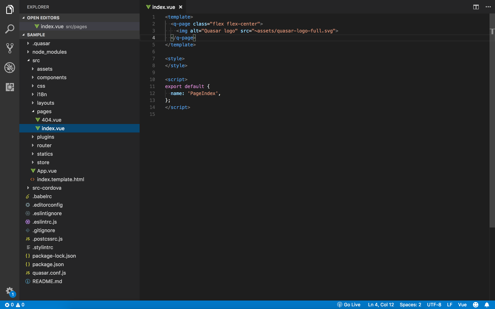
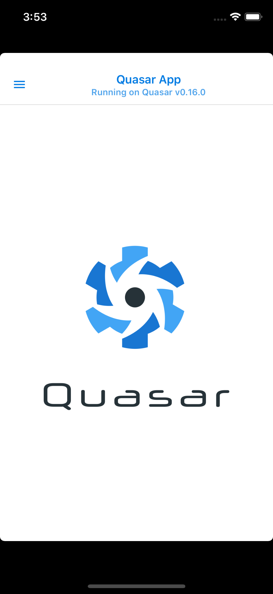
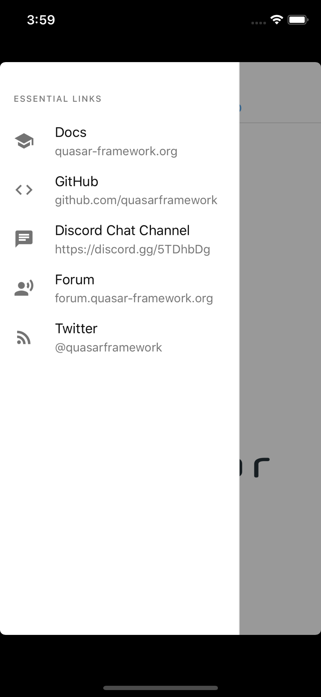

## Quasar でアプリつくろー

- - -
Yuya Miyazaki

<small>2018.07.12 @ Vue Night in Fukuoka</small>

---

Quasar つかったことある人

---

Cordova は？

---

※半分くらい Cordova の話です。

---

## Quasar とは？

- 正式名称は **Quasar Framework**
- Vue.js ベースでデスクトップアプリやモバイルアプリを作ることができる
- 基本的に web の技術ベースで開発（Electron/Cordova）
- pronounced **/ˈkweɪ.zɑɹ/**

---

## こういうときによい

- 開発速度を重視したい
- web のフロントが Vue.js で作られている
- Vue.js を使った開発経験がある
- それなりに実績やライブラリのあるビルド環境（Electron/Cordova）でマルチプラットフォーム開発したい

---

## さっそくアプリつくろー

今回は時間もないのでモバイル（特にiOS）アプリ想定で話します。

---

## 初期設定

<pre>
$ quasar init sample
 Running command: vue init 'quasarframework/quasar-starter-kit' sample
? Project name (internal usage for dev) **sample**
? Project product name (official name) **Quasar App**
? Project description **A Quasar Framework app**
? Author **y.miyazaki &lt;ymiyazaki@clustium.com&gt;**
? Check the features needed for your project: **ESLint, Vuex, Axios, Vue-i18n**
? Pick an ESLint preset **Airbnb**
? Cordova id (disregard if not building mobile apps) **org.cordova.quasar.app**
? Should we run \`npm install\` for you after the project has been created? (recom
mended) **NPM**
vue-cli · Generated "sample".
</pre>
<small>※ 先に **quasar-cli**, **vue-cli** をインストールしておく</small>

---


## ビルド for web
次のコマンドで web 版がブラウザ上でうごく。
```
$ quasar dev
```

<small>※詳細説明略</small>

---

## ビルド for mobiles
iOS:
```
$ quasar dev -m cordova -T ios -t ios
```

Android:
```
$ quasar dev -m cordova -T android -t mat
```

---

## ビルド待ち中にファイル構成を軽く見てみる

---



---




---

## もちろんホットリロード

---

## カメラとか使うには？

Cordova のプラグインをインストールする。

---

## （例）QRコードリーダー追加

#### プラグインインストール
```
$ cd src-cordova/
$ cordova plugin add cordova-plugin-qrscanner
```

#### パーミッション対応（iOS）
src-cordova/config.xml に追加。
```
<edit-config file="*-Info.plist" mode="merge" target="NSCameraUsageDescription">
    <string>QRコード読み取りのためにカメラを使用します。</string>
</edit-config>
```

---

## コードサンプル

```
  methods: {
    prepare() {
      if (!window.QRScanner) {
        alert('カメラにアクセスできません');
        return;
      }
      window.QRScanner.prepare((err, status) => {
        if (!status.authorized) {
          alert('カメラのパーミッション取得に失敗しました');
        }
      });
    },
    startScanning() {
      try {
        window.QRScanner.scan((err, text) => {
          if (err) {
            alert(text);
          }
          else {
            // Plugin: cordova-plugin-vibration
            navigator.vibrate(1000);
            this.$emit('onRead', text);
          }
        });
        window.QRScanner.show(() => {
        });
      }
      catch (e) {
        alert(e.message);
      }
    }
  }
```

---

## アプリアイコン
- アプリのアイコン等は config.xml に記載する。このあたりは Cordova のドキュメントに詳しく書かれている。
- 一度、以下を実行しないと変更反映されないかも……？
```
cordova platfrom remove [platform name]
cordova platfrom add [platform name]
```

---

## スプラッシュスクリーン
- プラグイン `cordova-plugin-splashscreen`

---

## 証明書等
- iOSでは `src-cordova/platforms/ios/[App Name].xcodeproj` が生成されているので、 XCode で開いてビルドターゲットや証明書等を設定する（platforms 以下は gitignore の対象なのでリポジトリには載らない）。

---

## よくありそうな質問と回答
1. 実際に動くサンプルありますか？
2. どのようなUIコンポーネントが提供されていますか？

→ Quasar Play で検索するとわかります。

---

Quasar でアプリつくろー
