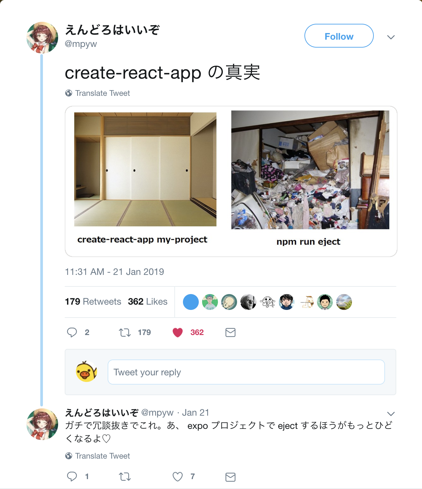

## React Native で<br>アプリ作って大変だった話

- - -
Yuya Miyazaki

<small>2019.01.25 @ React勉強会@福岡 vol.1</small>

---

### 半年前…


---

最近ずっと React Native でつくってます！

---

### 概要

- [ターゲット] React Native 使ったことないけど興味ある人。
- [内容] 半年前くらいに色々話題になってたけど実際どうなのみたいな観点から雑に。
- [前提] Expo SDK 30.0 (React Native 0.55.4) での話。

---

### （参考）使用したライブラリ

- データストア: MobX
- UIコンポーネント集: React Native Elements
- ナビゲーション: React Navigation
- 通信: Axios

---

### 目次

1. Expo の話
2. クロスプラットフォームの話
3. WebView の話<small> ← 時間あったら話す</small>
4. Cookie の話<small> ← たぶん話さない</small>

---

### 1. Expo の話

---

#### Expo とは

- React Native で手軽にスマホアプリを開発するツール群・環境。

---

#### expo-cli のコマンド（初期化）

```shell
$ expo init my-new-project
```

- アプリの雛形作ってくれる。

---

#### expo-cli のコマンド（開発）

```shell
$ expo start
```

- 実行すると同じ WiFi 環境内の実端末の Expo Client から接続できる（ホットリロード）。
- もちろん Expo Client ではなく独自のパッケージ名（バンドルID）を持ったアプリも作成可能。

---

#### expo-cli のコマンド（公開）

```shell
expo publish
```

---

- 実行するとアプリを公開できる。
- APK/IPA の生成もできる。
- ストア経由せずにアプリ更新可能。

---

#### Expo APIs

色々あります。

- MapView
- Location
- Linking
- ...

---

#### 微妙だったところ

- SDK 31 まで TypeScript に標準対応していなかった。
- Expo 用に Fork された React Native を使用するため、最新の React Native を使用できないことがある。
- ローカルIPアドレスを含むよくわからないファイル差分が生成される。

---

アプリ内課金等を実装したい場合は…

---

#### ネイティブライブラリ

- React Native のネイティブライブラリ（JS ではなく Android/iOS のコードを含むライブラリ）を使いたい場合は `expo detach` が必要。
- `detach` するとアプリアイコンの設定等は iOS/Android のネイティブプロジェクトを編集する必要がある。

---



最近見たツイート。

---

できれば Expo の枠組みの中で対応できると楽。

ちなみに以下は detach しないでも使用可能。
- Push 通知
- Apple Pay / Stripe による決済

---

## 2.クロスプラットフォームの話

---

- 注: iOS → Android の順で対応したので、 Android で OK だけど iOS では NG というパターンはあまり把握していません。

---

### Android でのみエラー

- Android では `<Text>...</Text>` の外にテキストがあるとエラーになる。

```JSX
  <View>
    {
      someflag ? <Text>someflag is true</Text> : ''
    }
  </View>
```

---

### Android でのみエラー 修正後

```JSX
  <View>
    {
      // someflag: Boolean
      someflag && <Text>someflag is true</Text>
    }
  </View>
```
文字列ではなく `false` なら問題なし。

---

### Android でたまに文字サイズが崩れる

- テキスト中にインラインで画像入れようとすると Android だけ画像のサイズが極端に小さくなる。
- 場合分けして対応。

---

### コンポーネント間の Array の受け渡しがうまくいかないことがある 1

- 別コンポーネント or ストアから渡ってきた配列 hoge を `Array.isArray(hoge)` としたときに `false` になることがある
- ブラウザでも iframe をまたぐ Array は別クラス扱いになるので、それと類似する現象？

[余談] そもそも Array かどうかの判定方法は…？

---

### コンポーネント間の Array の受け渡しがうまくいかないことがある 2

- でも `Object.prototype.toString.call (hoge)` も `[object Object]` になってしまう
- `hoge instanceof Array` は `true` だったりするので意味不明。

---

#### 対応策…

- 厳密ではないが `hoge.length` で判定してみる。
- `hoge ? Array.from(hoge) : null` のようにすると確実に配列（もしくは null ）になる。

---

### iOS 9 でのみ GET パラメーターの配列のシリアライズの挙動が異なる (Axios)

iOS9 だけ検索が動かない…なぜ…？

```js
data: {
  regions: ['tokyo']
}
```

---

iOS 12:
```
?regions[]=tokyo
```

iOS 9:
```
?regions=[%22tokyo%22]
```

---

#### 対応策…

- paramsSerializer を明示的に指定して対応。

```js
  const response = await Axios.get(url, {
    timeout: TIMEOUT,
    params: snakeCasedParams,

    // 追加
    paramsSerializer: (q) => qs.stringify(q, {arrayFormat: 'brackets'}),

    headers: this.commonHeaders
  });
```


---

### その他のコード分岐

- 主に課金周りと意図的なUI変更でコードを分岐させた程度。
- ただし次に述べる WebView / Cookie 周りを除く……。

---

まあそんな感じでOSバージョンによってJSエンジンが異なり微妙な差異があったりします。

---

## 3. WebView の話

- 素直に ReactNative コアに含まれる WebView コンポーネントを使用。

---

#### onShouldStartLoadWithRequest

- `onShouldStartLoadWithRequest` 属性でページ遷移前にページ遷移に処理を割り込ませ、場合によってはページ遷移をブロックできる。
- この属性は iOS でしか使えない。
- Android では `onNavigationStateChange` で一応近い処理を実装できるが、どうも100%確実には動かない感（次ページに続く）。

---

#### onNavigationStateChange

- iOS と Android で取得できるステートが異なる
- ここで発生するイベントから Android ではページ遷移なのか iframe で別ページ読み込んでいるのか、判別できなそう。
- あと、うまくイベントが発生しないことがある気がする……（Android だけ？）。

---

#### onMessage

- `onMessage` でページ内で発生したJSイベントを親コンポーネントに伝達することができる……はず。
- が、 iOS ではエラーが出て、うまく動かなかった。

---

#### 新しい WebView コンポーネント

- WebView コンポーネントはコアから Fork され、削除予定。
- Fork された WebView コンポーネント（react-native-community/react-native-webview）では Android でも `onShouldStartLoadWithRequest` に対応！
- ただし React Native 0.57 が必要。
- Expo SDK 31 (最新) は React Native 0.55 なので使用できない。


---

## 4. Cookie の話

---

悪いことは言わないから…

---

やめたほうがいい…

---

<small>
React Native コアの fetch() 使うにせよ Axios 使うにせよ…

- [iOS] レスポンスに Set-Cookie が複数ある場合、なぜかすべてカンマで結合された文字列しか取得できない。
- [iOS] ドメインをまたぐリダイレクトが発生する場合、複雑な事象（説明略）が発生する。
- [Android] レスポンスに Set-Cookie が複数ある場合、そのうちの1つしか取得できない。
- 低レイヤーで勝手に付与される Cookie と自分で実装したコードで明示的に付与する Cookie がマージされてサーバーに送信される。
- 結局、 Cookie 使って色々やろうとするとネイティブプラグインを使って OS に保存されている Cookie を引っ張ってくることになる。

</small>

---

## まとめ

- Expo の枠組みの中で実装できるなら楽。
- WebView で web と何らかの連携処理を入れようとすると結構大変。
- Cookie は触らないほうがいい。

---

Let's get started with React Native!!

<small>（屍を乗り越えて）</small>
